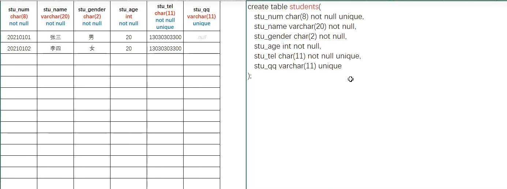

# 一、数据库操作

> 使用DDL语句可以创建数据库、查询数据库、修改数据库、删除数据库

## 1. 查询数据库

- 显示当前MySQL的数据库列表

    ```mysql
    show databases;
    ```

    

- 显示创建数据库时所使用的命令

    ```mysql
    show create databases <databaseName>;
    ```

    

## 2. 创建数据库

- 创建数据库语法

    ```mysql
    create database <databaseName>; // databaseName为需要创建的数据库名称
    ```

****

- ***在创建数据库时，可以指定数据库所采用的字符集***（gbk，utf8）

    ```mysql
    create database <databaseName> character set utf8;
    ```

## 3. 修改数据库

- 修改数据库字符集

    ```mysql
    alter database <databaseName> character set utf8;
    ```

## 4. 删除数据库

- 删除指定数据库

    ```mysql
    drop database <databaseName>;
    ```

## 5. 使用/切换数据库

- 使用/切换数据库

    ```mysql
    use database <databaseName>
    ```

    

#  二、数据表基础操作

> 数据表实际就是一个二维的表格，一个表格是由多列组成，表格中的每一类称之为表格的一个字段

## 1. 创建数据表

```mysql
create table <tableName>(<arg1>, <arg2>, ....);
```

- 示例

- MySQL命令

    ```mysql
    create table students(
    stu_num char(8) not null unique,
    stu_name varchar(20) not null,
    stu_gender char(2) not nunll,
    stu_age int not null,
    stu_tel char(11) not null unique,
    stu_qq varchar(11) unique
    );
    ```

- 创建效果如图所示

    

- 命令解析

    1. 数据表的每一个字段（一列）以英文逗号（ , )分隔

    2. stu_num stu_name 等等为字段名称

    3. char, varchar int 为数据类型,表示该列所存数据类型，括号内表示该类数据所能存入最大长度

        例如stu_tel 为学生手机号码，最大为11位，不能超过该长度

    4. char为固定长度字符，char(8)意为数据存储长度为8，**输入数据少于8则自动会用空格补全**

    5. varchar为可变字符，varchar(20)意为数据最大存储长度20，**但存储长度为输入数据长度**

    6. not null 关键字，意为必填项，在录入表数据时必须填入该数据

        - 当该列数据未加入not null 关键字且未填入数据时该项数据默认为null

    7. unique 关键字，意为唯一，在录入表数据与其他数据必须不一样

        

## 2.  显示数据表

```mysql
show tables;
```


## 3. 查询表结构

```mysql
desc <tableName>;
```


## 4. 删除数据表

```mysql
drop table <tableName>;
```


## 5. 修改数据表

### 5.1 修改数据表名

```mysql
alter table <tableName> rename to <tableNewName>;
```

- tableName为原表名称，tableNewName为修改后名称


### 5.2 修改数据表字符集

```mysql
alter table <tableName> character set utf8;
```


### 5.3 修改数据表字段(列)

#### 5.3.1 增添数据表字段(列)

```mysql
alter table <tableName> add <columnName> <type>;
```

- 示例

    给students表添加学生地址一列(stu_addr)

    ```mysql
    alter table students add stu_addr varchar(100);
    ```

    

    
    
    #### 5.3.2 修改数据表字段(列)名和类型

```mysql
alter table <tableName> change <oldColumnName> <newColumnName> <type>;
```

- 示例

    给students表的学生地址列(stu_addr)更名为stu_address, 并修改该列为长文本类型(text)

    ```mysql
    alter table students change stu_addr stu_address text; 
    ```


#### 5.3.3 只修改数据表字段(列)类型

```mysql
alter table <tableName> modify <columnName> <newType>;
```

#### 5.3.4 删除数据表字段(列)

```mysql
alter table <tableName> drop <columnName>;
```


# 三、数据表进阶操作

- *此章建议阅读完DQL内容再学习*

## 1. 数据表的关联关系介绍

- 数据表中

### 1.1 一对一关联


### 1.2 一对多关联

### 1.3 多对一关联

### 1.4 对对多关联

## 2. 创建外键约束数据表

> 外键约束：将一个列添加外键约束与另一张表的主键(唯一键)进行关联之后，这个外键约束列添加的数据必须要在关联的主键字段中存在

- 示例：班级表与学生表

**【方式一：创建表时添加外键约束】**

1. 先创建班级表

    ```mysql
    create table classes(
        class_id int primary key auto_increment,
        class_name varchaar(40) not null unique,
        class_remark varchar(200)
    );
    ```

    

2. 再创建学生表

    ```mysql
    create table students(
        stu_num char(8) primary key,
        stu_name varchar(20) not null,
        stu_gender char (2) not null,
        stu_age int not null,
        cid int,
        constraint FK_STUDENTS_CLASSES foreign key(cid) references classes(class_id)
    );
    ```

    - FK_STUDENTS_CLASSES 为字段值，但推荐按照以下规范命名

        FK\_[外键表名]\_[主键表名]

    - foreign key(cid) 中的cid为被设为外键字段

    - classes(class_id) 中的class_id 为外键关联的主键

【方式二：创建表后添加外键约束】

 1. 同样先创建班级表

    ```mysql
    create table classes(
        class_id int primary key auto_increment,
        class_name varchar(40) not null unique,
        class_remark varchar(200)
    );
    ```

	2. 创建普通的学生表

    ```mysql
    create table students(
        stu_num char(8) primary key,
        stu_name varchar(20) not null,
        stu_gender char (2) not null,
        stu_age int not null,
        cid int
    );
    ```

	3. 修改学生表

    ```mysql
    alter table students add constraint FK_STUDENTS_CLASSES foreign key(cid) references classes(class_id)
    ```

- *当学生表中存在学生信息关联班级表的摸条记录时，就不能对班级表主键进行修改和删除操作*

## 3. 删除外键约束

- 语法

    ```mysql
    alter table <tableName> drop foreign key <KeyName>;
    ```

- 例如删除上文外键约束

    ```mysql
    alter table students drop foreign key FK_STUDENTS_CLASSES;
    ```

    

## 4. 修改绑定外键的主键方法

 1. 将引用在需要修改的班级id所对应的学生的cid修改为null

    ```mysql
    update table students set cid = null where cid = 1; 
    ```

    

 2. 再修改班级信息表里的班级id

    ```mysql
    update table classes set class_id = 2 where class_id = 1;
    ```

    

 3. 将学生表的cid设置为修改后的班级id

    ```mysql
    update tabe students set cid = 2 where cid is null;
    ```

## 5. 级联

- 在添加外键约束时，可以添加**级联修改**和**级联删除**

- 级联修改：对外键绑定的主键进行修改会直接修改外键。

- 级联删除：删除外键绑定的主键也会删除绑定外键的数据

    即张三、王五绑定了一班，如果删除一班，张三、王五的数据也会一起删除

- 命令：

    ```mysql
    on update cascade on delete cascade;
    ```

- 上文创建数据表可以这样操作

    ```mysql
    create table classes(
        class_id int primary key auto_increment,
        class_name varchar(40) not null unique,
        class_remark varchar(200)
    );
    
    create table students(
        stu_num char(8) primary key,
        stu_name varchar(20) not null,
        stu_gender char (2) not null,
        stu_age int not null,
        cid int,
        constraint FK_STUDENTS_CLASSES foreign key(cid) references classes(class_id) 
        on update cascade on delete cascade
    );
    ```

- 当然也可以先删除外键再添加级联

    ```mysql
    alter table students drop foreign key FK_STUDENTS_CLASSES;
    
    alter table students add constraint FK_STUDENTS_CLASSES foreign key(cid) references classes(class_id)
    on update cascade on delete cascade;
    ```

    