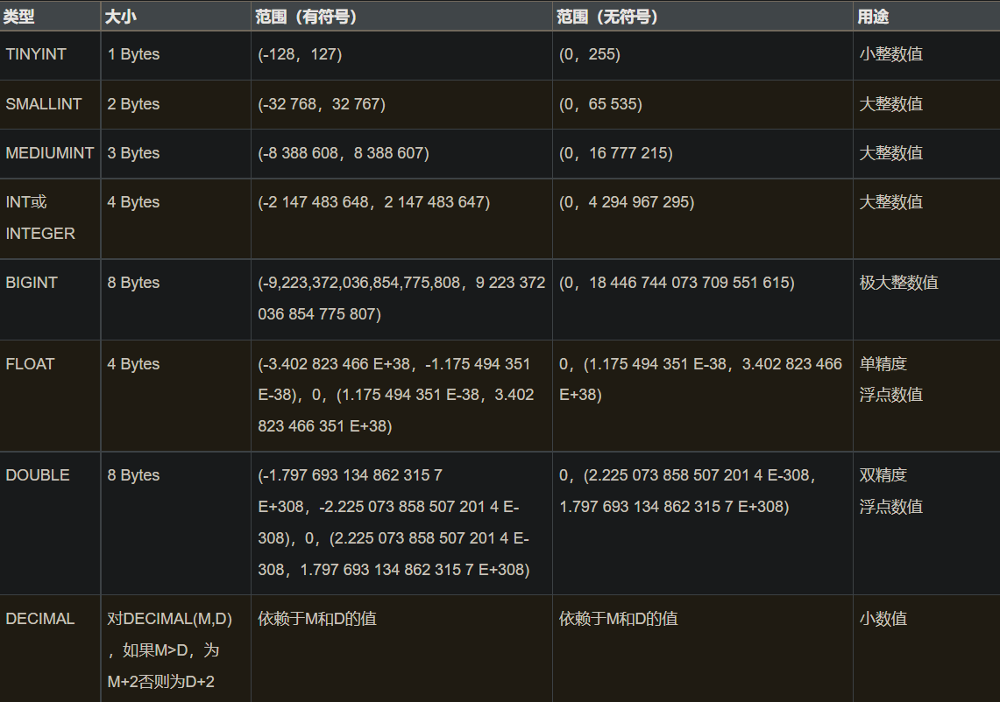
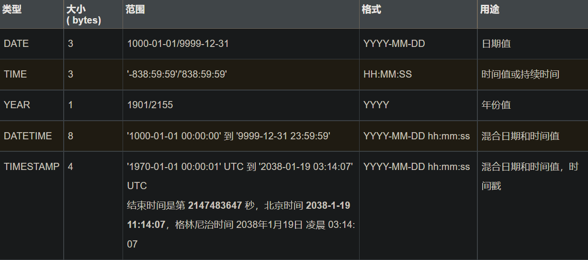

# MySQL 数据类型
MySQL 中定义数据字段的类型对你数据库的优化是非常重要的。

MySQL 支持多种类型，大致可以分为三类：
- 数值
- 日期/时间
- 字符串(字符)类型

## 1. 数值类型

MySQL 支持所有标准 SQL 数值数据类型。

这些类型包括
- 严格数值数据类型(integer、smallint、deciamal和 numeric)
- 近似数值数据类型(float、real 和 double precision)

关键字int是integer的同义词，关键字dec是decimal的同义词。

BIT数据类型保存位字段值，并且支持 MyISAM、MEMORY、InnoDB 和 BDB表。

作为 SQL 标准的扩展，MySQL 也支持整数类型 tinyint、mediumint和 bigint。下面的表显示了需要的每个整数类型的存储和范围。

## 2. 日期和时间类型
- 表示时间值的日期和时间类型为datetime、date、timestamp、time和year。
- 每个时间类型有一个有
- 效值范围和一个"零"值，当指定不合法的MySQL不能表示的值时使用"零"值。

## 3. 字符串类型
- 字符串类型指char、varchar、binary、varbinary、blob、text、enum和set。该节描述了这些类型如何工作以及如何在查询中使用这些类型。

| 类型       | 大小                  | 用途                            |
| ---------- | --------------------- | ------------------------------- |
| char       | 0-255 bytes           | 定长字符串                      |
| varchar    | 0-65535 bytes         | 变长字符串                      |
| tinyblob   | 0-255 bytes           | 不超过 255 个字符的二进制字符串 |
| tinytext   | 0-255 bytes           | 短文本字符串                    |
| blob       | 0-65 535 bytes        | 二进制形式的长文本数据          |
| text       | 0-65 535 bytes        | 长文本数据                      |
| mediumblob | 0-16 777 215 bytes    | 二进制形式的中等长度文本数据    |
| mediumtext | 0-16 777 215 bytes    | 中等长度文本数据                |
| longblob   | 0-4 294 967 295 bytes | 二进制形式的极大文本数据        |
| longtext   | 0-4 294 967 295 bytes | 极大文本数据                    |

- char和 varchar 类型类似，但它们保存和检索的方式不同。它们的最大长度和是否尾部空格被保留等方面也不同。在存储或检索过程中不进行大小写转换。

- binary 和 varbinary 类似于 char和 varchar，不同的是它们包含二进制字符串而不要非二进制字符串。也就是说，它们包含字节字符串而不是字符字符串。这说明它们没有字符集，并且排序和比较基于列值字节的数值值。

- blob是一个二进制大对象，可以容纳可变数量的数据。有 4 种 blob类型：tinyblob、blob、mediumblob和 longblob。它们区别在于可容纳存储范围不同。

- 有 4 种 text类型：tinytext、text、mediumtext和 longtext。对应的这 4 种 blob类型，可存储的最大长度不同，可根据实际情况选择。